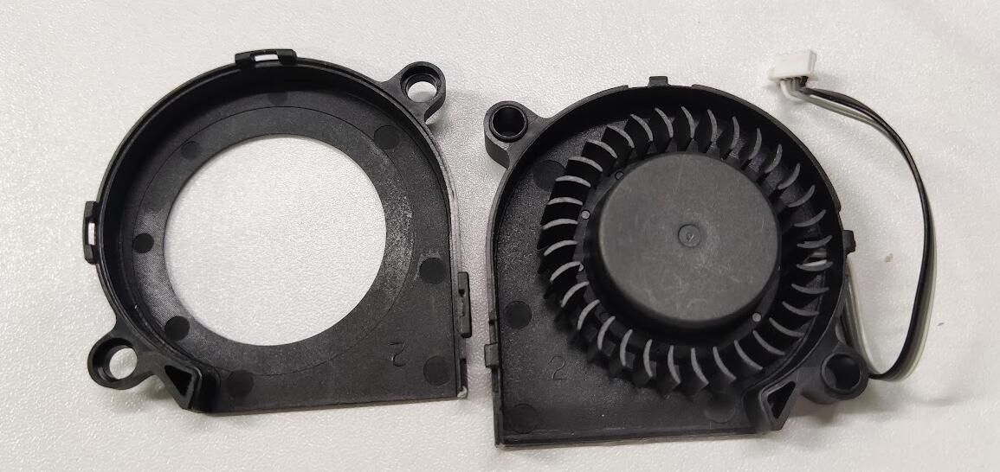
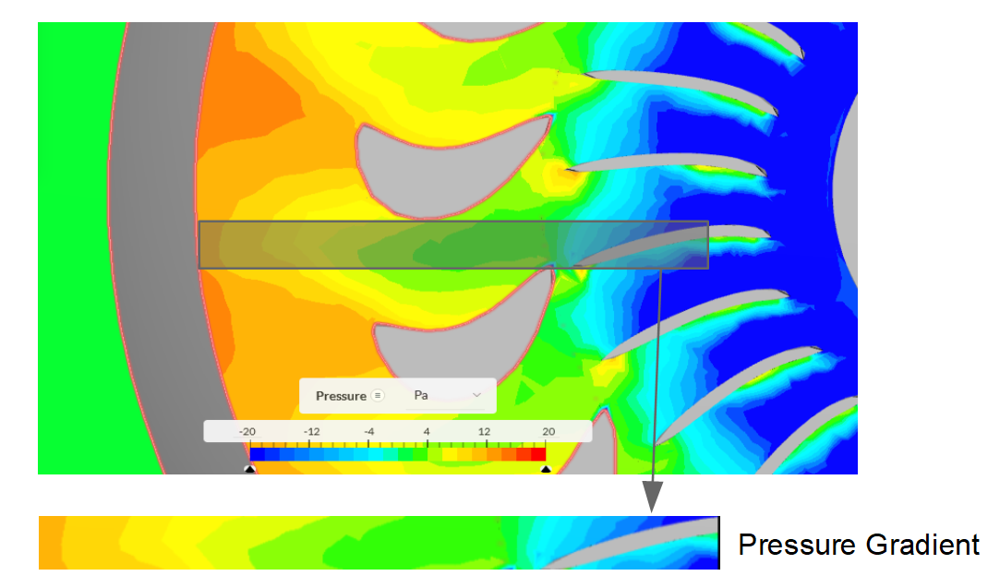
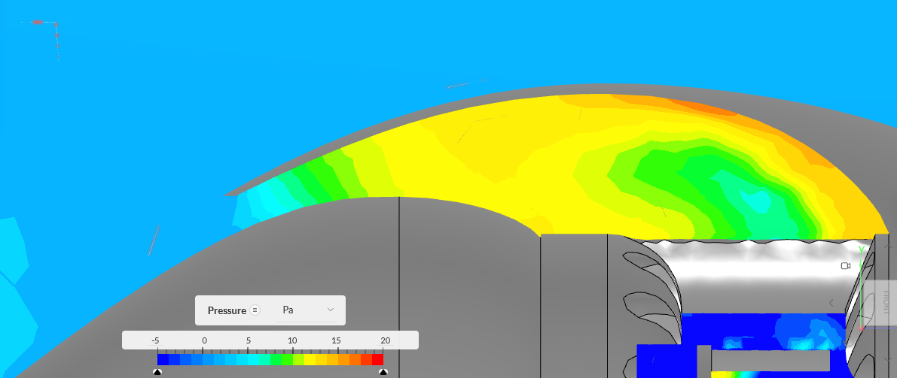
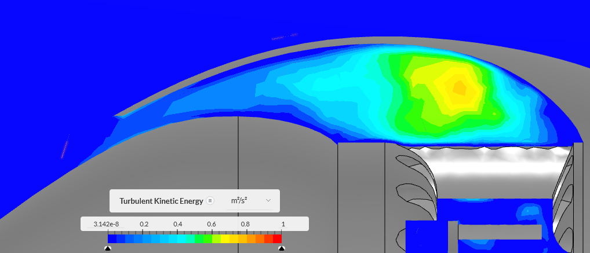
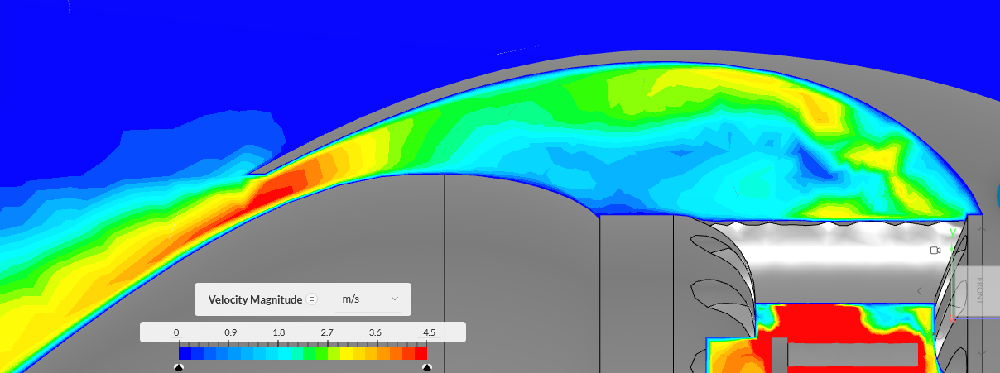
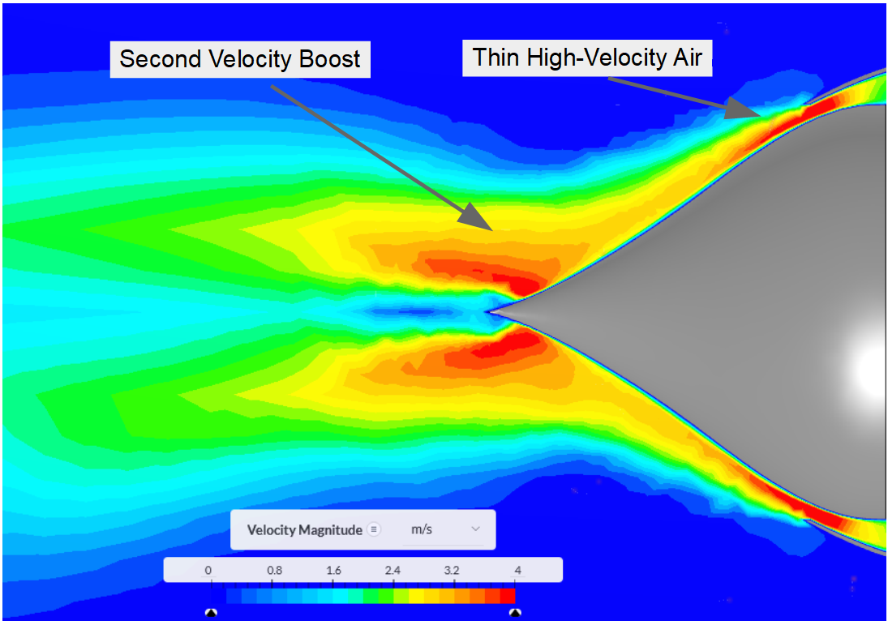
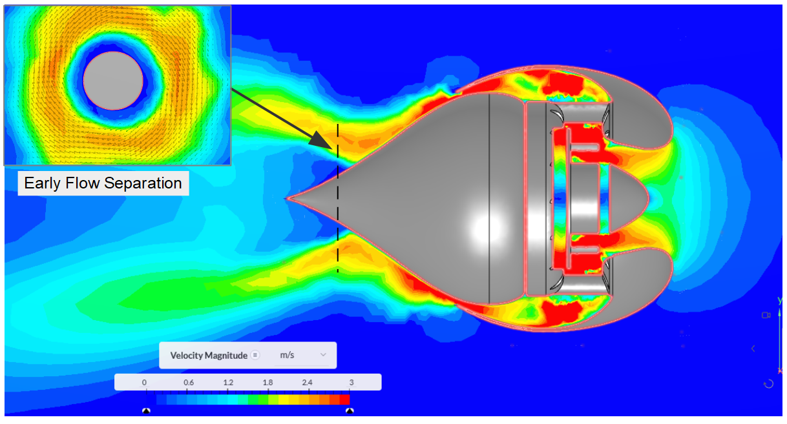

# Aerospike Fan

A blade-less fan powered by Bambu Lab X1 toolhead turbo. The name "Aerospike Fan" comes from the aerospike nozzle. 

## Principle

Same as a regular "blade-less fan", this aerospike fan uses below principle to move air: 

> blowing a thin high-velocity smooth airflow from a continuous slot across the surface of the tube or toroid.

The difference is that the aerospike can generate a narrow and high velocity stream of air, but the regular blade-less is focus on moving large volume of air. 

However, aerospike nozzle is for hypersonic airflow which normally seen in jet engine and rocket engine to adapt wide range of atmosphere pressure (altitude). It can maintain high efficiency because the half of the engine nozzle is the external atmosphere pressure, so the exhaust expansion rate is compensated automatically. 

**How it is beneficial to the fan?**

The answer is, no it isn't. 

1. The fan is only be used at sea level i.e. my desktop..and never changed. The exhaust isn't heated up, so it wont expand. The adaptability of aerospike nozzle has no effect here.

2. A single high velocity stream can move less air than a regular blade-less fan, make it feel weaker than other fans. 

3. The small area of the spike also means that it wont be able to suck enough air. 

4. Possible noise. 

**Difficulties**

1. Fan, air pressure and exhaust speed are hard to design and simulate. 

2. Air flow is invisible, not sure how hard is it to keep the exhaust air flow steady.

## Design and Simulation

### Turbo Fan

The core of the fan is powered by the tool head fan of [Bambu Lab X1C](https://bambulab.com/) 3d printer. It is a 5015 fan (5CM x 1.5 CM), rated at 24V 0.15A, quite a powerful fan. The centrifugal fan has 33 blades (if i counted that correctly.)

### Compressor

Compressor compresses the air flow and maintained a high pressure difference in the internal chamber. The compressor is consist of a ring of static blades. 

1. The fans converts its kinetic energy to the surrounding air by accelerating the air velocity. 

2. While high velocity air flows into the compressor, it goes through a expansion channel, with the direction change dramatically. The velocity will drop while the pressure increased dramatically. (Convert the kinetic energy back to potential energy).

An example of pressure gradient increased when passing by the compressor, at 5000rpm. (its a pity that the software couldn't show X and Y velocity magnitude but only a single axis, cannot visualize the velocity here. )

### High pressure chamber

High pressure chamber is a space that stabilize the air comes out of compressor. It has several static blades that split the ring chamber into smaller sections. So the vortex and turbulence generated by the compressor can be settle down quicker. We need the air as stable as possible before it reach the exhaust, because vortex or turbulence will break the "thin high-velocity smooth airflow" easily.

Pressure gradient, the high-pressure chamber can maintain a 10~15 Pa pressure in 5000 RPM. 

The turbulence will reduced near the nozzle. 

### Accelerating channel

Accelerating channel is the opposite to the compressor, it convert high-pressure, low velocity air flow to low pressure high, velocity air flow.  

> For a jet engine, here is the position of turbo fans

In this channel, air pressure decrease while air speed increased dramatically. 

### Aerospike nozzle

Now we have a ring of thin high velocity flow, but the ring of low doesn't go far unless it can transfer its energy to the surrounding air. Where the aerospike nozzle come into place. 

> In a regular blade-less fan, they have a much larger rings so can accelerate as much air as possible. 

The thin airflow follows the surface of aerospike nozzle because of Bernoulli's principle.
As the airflow goes forward, the ring is getting smaller and smaller near the tips of aerospike, then the air got a second velocity boost, finally result in a single high velocity stream. This is actually very interesting, I learnt that only until I saw the simulation results. 

Because the air move so quickly around the nozzle surface, the pressure decreases and the static air around the nozzle is pulled by the high velocity flow. So the steam is scale up  multiple times. 

The result of the fan is a narrow and high velocity air stream which can be point at an exact location. 

## What could be wrong

There are many things can go wrong. 
A steady and thin air flow, following the aerospike nozzle are the essential factors to construct the high velocity stream, or lower the efficiency.

- Unstable air flow caused by surging or turbulence.
- Flow separating from nozzle. 
- The size of nozzle.
- The ratio of flow volume and pressure. 

### Flow separation too early

I don't know exact reason of the flow separate before the tip of aeropsike, it looks like relate to the thickness of the exhaust air ring and the velocity of exhaust air flow. But the early separation slow down the air around the tip and eliminate the second speed boost. It also create a bubble of turbulence around the tip which expend the ring of the high velocity flow instead of merge. 

The flow separation is also caused by the rotation around the nozzle, which wont be an issue because the actually model has more fins to stop the residual rotation after the compressor. This is a bad example due to insufficient compressor design that cannot stop the spinning air.  When the air flow close to the tip with the reducing radius, the rotation speed increased, result in the the air flow separated and turbulence.

### Ratio of flow volume and pressure

The fan rotation, intake area, exhaust ring area are critical to affect the pressure difference, the thickness of exhaust ring and so the exhaust air velocity. 

## Simulation

I have done 8 CFD using Simscale, a cloud based Computational Fluid Dynamics platform. The free community plan has 10 successful simulation limit. Barely enough if you don't count fail simulations, such as once i did not spin the fan... 

I am starting to worry my future CFD sims..
