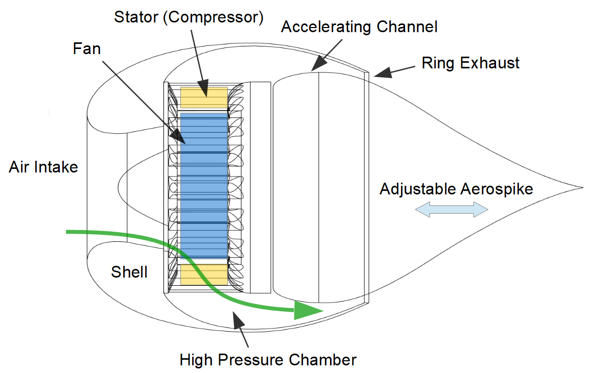

# Aerospike Fan

A bladeless fan powered by Bambu Lab X1 toolhead turbo. 

## Principle

Same as a regular "bladeless fan", this aerospike fan uses below principle to move air: 

> blowing a thin high-velocity smooth airflow from a continuous slot across the surface of the tube or toroid.

The difference is that the aerospike can generate a narrow and high velocity stream of air, but the regular bladeless is focus on moving large volume of air. 

However, aerospike nozzle is for hypersonic airflow which normally seen in jet engine and rocket engine to adapt wide range of atmosphere pressure (altitude). It can maintain high efficiency because the half of the engine nozzle is the external atmosphere pressure, so the exhaust expansion rate is compensated automatically. 

**How it is benefitial to the fan?**

The answer is, no it isnt. 

1. The fan is working in sea level i.e. my desktop..and never changed. The exhaut isnt heated up, so it wont expand. The adaptability of aerospike nozzle has no effect here.

2. A single high velocity stream can move less air than a regular bladeless fan. 

3. The small area of the spike also means that it wont be able to suck enough air. 
4. Possible noise. 

**Difficulties**

1. Fan, air pressure and exhaust speed are hard to design and simulate. 

2. Air flow is invisible, not sure how hard is it to keep the exhaust air flow steady.

## Design and Simulation

### Turbo Fan
The core of the fan is powered by the tool head fan of [Bambu Lab X1C](https://bambulab.com/) 3d printer. It is a 5015 fan (5CM x 1.5 CM), rated at 24V 0.15A, quite a powerful fan. The centrifugal fan has 33 blades (if i counted that correctly.)

### Compressor
Compressor is the key for creating high pressure zone. The compressor is consist of a ring of static blades. 

The fans converts its kenetic the energy to the surrending air by accelerating the air velocity. 
Then, the stator stops the air flow and converting the kenetic energy back to protential energy, increased pressure. 

While high speed air flow into the compressor, it goes through a expension channel, with the direction change dramaticlly. The velocity will drop while the pressure increased dramaticlly. 

### High pressure chamber

High pressure chamber is a space that further stablize the air, it has several static blades that split the ring chamber into smaller sections. So the vortex generated by compressor can be settle down quicker. We need the air as stable as possible before it reach the exhaust, because vortex or turbulance will break the "thin high-velocity smooth airflow" easily.

### Accelerating channel

Accelerating channel is the opposite to the compressor, it convert high-pressure, low velocity air flow to low pressure high, velocity flow. 
During this channel, pressure decreased while air speed increase dramaticlly. 

### Aerospike nozzle

Now we have a ring of thin high velocity flow, but the ring of low doesnt go far unless it can its energy to the surrounding air. Where the aerospike nozzle come into place. 

The thin airflow follow the surface of aerospike nozzle because of Bernoulli's principle.
The ring is getting smaller and smaller near the tips of aerospike, then the air got a second velocity boost. 

